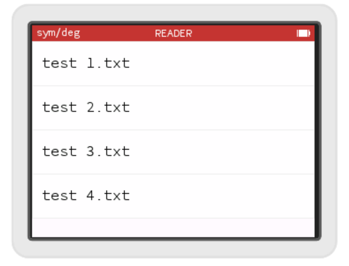

# Lister les fichiers

Nous arrivons maintenant à afficher une liste de fichiers dans une `TableView`. Il nous reste à accéder réellement aux fichiers de la Numworks. Souvenons-nous que nous ne voulons pas afficher n'importe quels fichiers, uniquement les fichiers .txt.

Omega fournit une API (Application Programming Interface, un ensemble d'objets et fonctions) pour accéder à des fichiers stockés dans une archive TAR dans une zone libre de la mémoire de la Numworks. Nous n'avons pas réellement besoin de savoir comment ce stockage fonctionne. L'API dans `apps/external/archive.h` fournit 2 fonctions qui vont nous suffire:
```c++
size_t numberOfFiles();
bool fileAtIndex(size_t index, File &entry);
```

Nous allons utiliser ces fonctions pour parcourir tous les fichiers et filtrer ceux dont le nom finit par ".txt". Malheureusement, ni Omega ni Numworks ne fournissent de fonction pour filtrer les fichiers selon leur extension, ou je n'ai pas trouvé...

Nous allons coder nous-même cette fonctionalité au moyen de 2 fonctions. La première que nous appellerons `stringEndsWith` s'assurera qu'une chaîne de caractères passée se termine avec un certain motif (nous utiliserons ".txt" mais la fonction restera générique). L'algorithme est assez simple, nous allons partir de la fin de la chaîne et de la fin du motif et comparer les caractères en descendant vers le début du motif. Si les 2 caractères sont différents alors la fonction renvoie `false` sinon on continue jusqu'au début de l'extension.

Voici la signature de la fonction :
```c++
bool stringEndsWith(const char* str, const char* pattern)
```

### Les chaînes de caractères

En C++, les chaînes de caractères sont représentées par des instances de la classe `std::string`, malheureusement cette classe n'est pas disponible sur la Numworks. Nous devons donc utiliser la représentation C. En C, une chaîne de caractères est stockée dans un tableau de `char` terminé par un 0 (la valeur 0, par le caractère '0'). En pratique, quand on déclare une chaîne de caractères, on utilise rarement un tableau (`char chaine[NB]`) mais un pointeur vers le premier caractère `char*`. Notre fonction ne devant pas modifier les chaînes de caractères qu'elle manipule, on s'en assure en les préfixant de `const`. Si on essayait de modifier un caractère, le compilateur produirait une erreur. C'est le contenu de ce qui est pointé qui ne peut pas être modifié, le pointeur, lui peut pointer vers autre chose si on le souhaite. 

Nous allons tout d'abord calculer la longueur de chacune des chaînes de caractères, pour cela une fonction C standard existe et est disponible sur le Numworks, il s'agit de `strlen`. Pour cela, il nous faut rajouter l'include `<string.h>` dans notre fichier qui déclare cette fonction. Une fois les 2 longueurs de chaînes connues, on peut tout de suite sortir de la fonction en renvoyant `false` si le `pattern` est plus court que la chaîne `str`
```c++
bool stringEndsWith(const char* str, const char* pattern)
{
    int strLength = strlen(str);
    int patternLength = strlen(pattern);
    if (patternLength > strLength)
        return false;
```

### Arithmétique sur les pointeurs

Si le `pattern` est plus long que `str`, on va calculer un pointeur sur la fin de chacune des deux chaînes pour pouvoir parcourir les chaînes de la fin vers le début. Les pointeurs ont une propriété intéressante quand ils représentent une case d'un tableau (ce qui est le cas lorsqu'ils pointent vers une chaîne de caractères), quand on ajoute 1 au pointeur on le fait pointer sur la case d'après. Ainsi pour aller à la dernière case du tableau, il suffit d'ajouter la longueur du tableau au pointeur.
```C++
    const char* strIter = str + strlen(str);
    const char* patternIter = pattern + strlen(pattern);
```
Nous définissons ainsi 2 nouveaux pointeurs qui pointent cette fois sur les fins de chaînes.

### Déréférencement de pointeur

Pour obtenir la valeur (ou l'objet) que pointe un pointeur il faut le déréférencer. Cela se fait avec l'opérateur `*`. Ainsi si on a un pointeur vers un char: `char* p`, on obtient le char pointé en faisant `*p`. Attention si le pointeur pointe vers 0, `NULL` ou `nullptr` le déréférencer fera se crasher le programme ! Si le pointeur n'a pas été initialisé et contient donc une valeur aléatoire dépendant de l'état de la mémoire au moment où le pointeur est déclaré, le comportement en cas de déréférencement sera aléatoire (un crash restant possible).

Nous allons parcourir les chaînes en partant de la fin tant que les caractères sont identiques et ce jusqu'au début du `pattern` :
```c++
    while(*strIter == *patternIter)
    {
        if(patternIter == pattern)
            return true;
        strIter--;
        patternIter--;
    }
```

Si `*strIter == *patternIter` alors les caractères "actuels" de `str` et de `pattern` sont identiques, on continue.

Si `patternIter == pattern` alors on a atteint le début du `pattern`.

`strIter--` permet de décrémenter le pointeur (il pointe sur la case précédente). C'est équivalent à `strIter -= 1` ou encore `strIter = strIter - 1`

Si on sort de la boucle car `*strIter != *patternIter` alors `str` ne finit pas par `pattern` on peut renvoyer `false`.

Nous allons mettre cette fonction dans un nouveau fichier .cpp dans lequel nous mettrons ainsi des petites fonctions utilitaires qui pourrait nous être utiles dans un autre contexte.

## De nouveaux fichiers pour des fonctions utiles

Créons ainsi un nouveau header : `apps\reader\utility.h`, avec include guard et namespace, et déclarons notre fonction.
```c++
#ifndef __UTILITY_H__
#define __UTILITY_H__

namespace reader
{

bool stringEndsWith(const char* str, const char* end);

}
#endif
```

et un nouveau fichier .cpp : `apps\reader\utility.cpp` que nous ajoutons tout de suite au Makefile histoire de ne pas oublier et éviter une erreur de compilation difficile à comprendre...
```Makefile
app_sreader_src = $(addprefix apps/reader/,\
  app.cpp \
  list_book_controller.cpp \
  utility.cpp \
)
```

```C++
#include "utility.h"
#include <string.h>

namespace reader
{

bool stringEndsWith(const char* str, const char* pattern)
{
    int strLength = strlen(str);
    int patternLength = strlen(pattern);
    if (patternLength > strLength)
        return false;
        
    const char* strIter = str + strlen(str);
    const char* patternIter = pattern + strlen(pattern);

    while(*strIter == *patternIter)
    {
        if(patternIter == pattern)
            return true;
        strIter--;
        patternIter--;
    }
    return false;
}

}
```
## Parcourons les fichiers

Maintenant que nous avons notre petite fonction `stringEndsWith` utilisons la. Nous allons écrire une fonction qui va parcourir les fichiers présents sur la calculatrice et copier ceux qui qui finissent par une certaine extension dans un tableau passé en paramètre. La fonction prendra en paramètre la taille du tableau fourni, pour ne pas y mettre plus de fichier qu'on peut y stocker, et renverra le nombre de fichiers effectivement ajoutés au tableau. Cette fonction pourrait être utile dans d'autres contexte. Nous allons donc la déclarer dans notre fichier `utility.h` :
```c++
`int filesWithExtension(const char* extension, External::Archive::File* files, int filesSize) ;`
```

Comme notre fonction fait référence au type `External::Archive::File` dans sa déclaration, ce type doit être au préalable déclaré. Pour cela nous devons rajouter l'include suivant en haut de notre fichier :\
```c++
#include <apps/external/archive.h>
```

Nous implémentons la fonction dans `utility.c` :
```c++
int filesWithExtension(const char* extension, External::Archive::File* files, int filesSize) 
{
    size_t nbTotalFiles = External::Archive::numberOfFiles();
    int nbFiles = 0;
    for(size_t i=0; i < nbTotalFiles; ++i)
    {
        External::Archive::File file;
        External::Archive::fileAtIndex(i, file);
        if(stringEndsWith(file.name, ".txt"))
        {
            files[nbFiles] = file;
            nbFiles++;
            if(nbFiles == filesSize)
                break;
        }
    }
    return nbFiles;
}
```

Quelques remarques. Pour recevoir notre tableau en paramètre, la fonction accepte un pointeur vers sa première case. 

`size_t` est un type qui contient des entiers positifs.

On voit qu'on a déclaré un objet de type `File` s'appelant `file`, `file` n'est pas un pointeur, mais l'objet lui même. Quand on fait `m_files[m_nbFiles] = file` on copie tout le contenu de la structure `File` de `file` dans `m_files[m_nbFiles]`.

Une ligne doit cependant vous semblez étrange :
```C++
External::Archive::fileAtIndex(i, file);
```
on s'attendrait plutôt à cette ligne :
```C++
file = External::Archive::fileAtIndex(i);
```
non ?

En fait, avant (il y a des dizaines d'années), renvoyer une structure ou un objet (plutôt qu'un pointeur) était coûteux (en temps) car le retour faisait une copie. Ce n'est plus vraiment le cas aujourd'hui, mais les développeurs ont pris l'habitude de passer les structures ou objet en paramètre à la fonction, pour que la fonction les remplisse. C'est ce qu'a fait le développeur qui a codé cette fonction. On passe donc un `File` non initialisé à cette fonction qui le remplira avec les `File` à l'index `i` dans l'archive TAR contenant les fichiers. Nous avons fait de même, nous ne renvoyons pas un tableau mais notre fonction reçoit en paramètre un tableau que nous devons remplir, on ne reçoit pas une copie du tableau, mais l'adresse de sa première case, ce qui fera que les modifications que nous y ferons dans notre fonction, s'appliqueront au tableau qui aura été passé en paramètre.

# Les références

Peut-être avez-vous encore une question. On ne donne pas à `fileAtIndex` un pointeur vers notre `file` mais directement notre `file`, c'est donc une copie de `file` que devrait recevoir la fonction. Si elle modifie cette copie, nous ne devrions pas voir de changement dans notre propre `file`.

En regardant de plus près la signature de la fonction dans le fichier, vous verrez peut-être un symbole particulier ?
```c++
bool fileAtIndex(size_t index, File &entry);
```
Le `&`. Nous l'avons déjà rencontré dans un autre contexte, où il servait à obtenir l'adresse d'un objet. Là, c'est tout autre chose, qu'on appelle référence. Un `File &` est une référence vers un `File`. Une référence est comme un autre nom qu'on donne à une variable. Ainsi si on écrit :
```c++
File a;
File & b = a;
b.name = "hello";
``` 
alors `a.name` contient également `"hello"` en fait `a` et `b` sont le même objet en mémoire et `a.name` et `b.name` sont la même chaîne de caractères. Quand on utilise une référence en déclarant un paramètre d'une fonction, alors ce paramètre sera un "alias" vers l'objet qui est passé en paramètre lors de l'appel de la fonction.

Cela est valable pour les objets comme pour les types "primaires" comme les int. Ainsi, si on écrit :
```c++
void f(int & a)
{
    a = 1;
}

void main()
{
    int i = 0;
    f(i);
    print(i);//en réalité cette fonction ne s'utilise pas comme ça en C
}
```
Le programme affichera 1. En effet le paramètre `a` manipulera la variable `i` qui est passée à f. Alors que si on écrit :
```c++
void g(int b)
{
    b = 1;
}

void main()
{
    int i = 0;
    g(i);
    print(i);
}
```
Le programme affichera 0, en effet le paramètre `b` recevra une copie de `i`, modifiera cette copie sans toucher à `i`.

Une petite subtilité, une référence doit nécessairement référencer quelque chose. On ne peut pas simplement déclarer une référence `int &a;` cela produira une erreur. Il faut lors de la création déclarer ce que référence la référence :
```c++
int a;
int& b = c;
```
a et b sont ainsi le même objet (qui n'est pas initialisé et contient potentiellement n'importe quelle valeur). Attention, on ne peut pas ensuite dire qu'un référence référence un autre objet. En effet, si on affecte une nouvelle valeur à la référence, cela va en réalité copier le contenu de ce qu'on affecte à la référence et à l'objet qu'elle référençait! Ainsi:
```c++
int a = 1;
int& b = a;
int c = 2;
b = c;
print(a);
```
Le programme affichera 2, car on a copié la valeur de c (2), dans b qui est aussi a.

Compliqué? Souvenez-vous juste que lorsque un `&` est utilisé sur le type d'un paramètre d'une fonction, alors il s'agit d'un passage par référence (sinon il s'agit d'un passage par valeur), et que les modifications faites au paramètre s'appliqueront à l'extérieur de la fonction (ce qui n'est pas le cas lors d'un passage par valeur). On peut également vouloir utiliser le passage par référence pour éviter une copie, mais on ne souhaite pas modifier le paramètre, dans ce cas on utilisera une `const` référence, par exemple si on a :\
```c++
void print(const UnGrosObjet& obj);
```
la fonction évite la copie d'`UnGrosObjet` en le recevant par référence, mais le code appelant a la garantie que la fonction ne modifiera pas son objet.

Ne peut-on pas faire la même chose avec les pointeurs? Si tout à fait, une différence néanmoins importante c'est qu'un pointeur peut être `NULL` alors qu'une référence référencera toujours quelque chose. Un avantage des références est de permettre la même syntaxe (avec des `.` plutôt que des `->` et pas de `*` pour déréférencer un pointeur) que le paramètre soit passé par référence ou par valeur.

## Retour dans le `ListBookController`

Après cette digression, revenons à notre application. Dans le constructeur de notre `ListBookControler` nous allons appeler notre nouvelle fonction pour remplir notre tableau de fichiers `m_files`. Notre constructeur devient:
```c++
ListBookController::ListBookController(Responder * parentResponder):
    ViewController(parentResponder),
    m_tableView(this, this)
{
    m_nbFiles = filesWithExtension(".txt", m_files, NB_FILES);
}
```

et n'oublions pas d'inclure notre fichier `utility.h` dans `list_book_controller.cpp` !
```c++
#include "utility.h"
```

## On essaie ?

Si vous compilez et lancer le programme sur le simulateur il ne se passera probablement rien de nouveau. Au moment où j'écris ces lignes, la fonction qui liste les fichiers ne marche que sur la Numworks et pas sur le simulateur.
On va donc compiler pour la Numworks :\
`$ make PLATFORM=device MODEL="n0110"`\
puis après avoir branché la calculatrice :\
`$ make PLATFORM=device MODEL="n0110" epsilon_flash`

Si vous lancez maintenant votre application sur la calculatrice, vous aurez la joie de ne voir rien de neuf! Il faudrait peut être mettre quelques fichiers texte dans votre calculatrice. Pour cela utilisez ce [site](https://omega-numworks.github.io/Omega-External/)




et voilà!