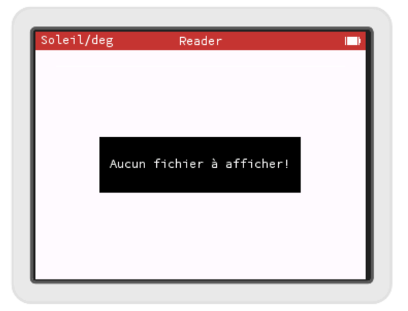

# Une liste avec sélection

La prochaine étape consiste à nous permettre de sélectionner le livre à ouvrir et à pouvoir scroller dans la liste, car si vous avez listé plus de 5 fichiers, vous avez dû vous rendre compte que pour l'instant ça ne scroll pas...

Numworks fournit une `View` un peu mieux que la `TableView` : la `SelectableTableView`. Ca tombe bien, non?


## La SelectableTableView

Donc remplaçons notre `TableView m_tableView;` par `SelectableTableView m_tableView` dans le header de notre controlleur (`list_book_controller.h`).

Pour l'instant notre `ListBookController` dérivait (entre autre) de `ScrollViewDataSource`, nous allons à la place hériter de `SelectableTableViewDataSource` qui dérive de `ScrollViewDataSource` et va en plus gérer la sélection. La définition de notre classe commence donc maintenant ainsi :
```c++
class ListBookController : public ViewController, public SimpleListViewDataSource, public SelectableTableViewDataSource
{
```

Ce changement a un impact au niveau du constructeur du `ListBookController`, il faut rajouter un `this` quand on appelle le constructeur de la `SelectableTableView` :
```c++
ListBookController::ListBookController(Responder * parentResponder):
    ViewController(parentResponder),
    m_tableView(this, this, this)
{
    m_nbFiles = filesWithExtension(".txt", m_files, NB_FILES);
}
```

## Le first responder

La `SelectableTableView` est un `Responder`, c'est à dire qu'elle peut gérer un certain nombre d'événements pour gérer la sélection. Mais pour capter ces événements, il faut qu'elle soit "first responder". Or pour l'instant c'est le `ListBookController` qui est le first responder quand il est à l'écran. Il faut qu'il transmette ce status à la `SelectableTableView`, pour cela on va redéfinir 
```c++
void didBecomeFirstResponder() override;
```

Cette méthode est appelée quand la vue du contrôleur apparaît. On va en profiter pour sélectionner la première cellule de la liste, et donner le status de first responder à la `m_tableView` :
```c++
void ListBookController::didBecomeFirstResponder()
{
    if (selectedRow() < 0) {
        selectCellAtLocation(0, 0);
    }
    Container::activeApp()->setFirstResponder(&m_tableView);
}
```

## Afficher un message

S'il n'y a pas de fichier texte dans la calculatrice, l'écran blanc nous laisse penser que peut-être quelque chose ne marche pas. Nous allons plutôt afficher un petit message dans une fenêtre popup. Pour cela Numworks propose la fonction `Container::activeApp()->displayWarning()`. Nous rajoutons ce petit message dans le `didBecomeFirstResponder()` :
```c++
void ListBookController::didBecomeFirstResponder()
{
    if (selectedRow() < 0) {
        selectCellAtLocation(0, 0);
    }
    Container::activeApp()->setFirstResponder(&m_tableView);
    if(m_nbFiles == 0)
    {
        Container::activeApp()->displayWarning(I18n::Message::NoFileToDisplay);
    }
}
```

Pour l'internationalisation, nous rajoutons une entrée dans nos fichiers ".i18n" :
`NoFileToDisplay = "Aucun fichier à afficher!"`

Je vous laisse chercher la traduction dans toutes les langues et tester !

Enlevez tous vos fichiers .txt de test pour voir le message !



