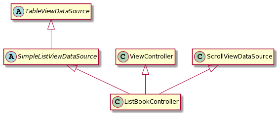
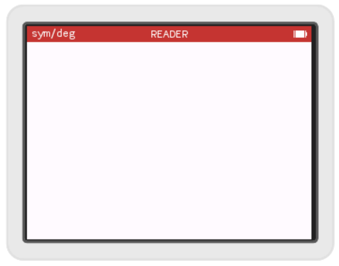

# La liste des livres - première partie

Nous allons maintenant réaliser un écran qui va lister les fichiers textes disponibles dans la mémoire  de la calculatrice. Pour cela il y a plusieurs choses à aborder : quels widgets (composant graphique) fournit Numworks pour réaliser un tel écran ? Comment lister les fichiers textes de la mémoire ?

Nous allons procéder par petites étapes successives.

## Affichage d'un écran

On va dans un premier temps rajouter le code nécessaire à ce que notre application puisse s'ouvrir sans planter la calculatrice.

Lorsqu'on réalise une application avec un GUI (Graphical User Interface), un "pattern" fréquent est le MVC (Model-View-Controller). Ce pattern consiste à séparer le code en plusieurs ensembles de classes :
- un modèle qui représente ce que l'application manipule. En l'occurrence, dans notre cas, le modèle consistera en une collection de fichier texte.
- une vue qui permet d'afficher tout ou partie du modèle, nous utiliserons une vue fournie par Numworks : la TableView qui permet d'afficher un tableau dans lequel nous listerons nos fichiers.
- un contrôleur qui va faire le lien entre l'utilisateur, ses actions sur le modèle et la réaction de la vue.

### Le header

Nous allons donc dans un premier temps coder le contrôleur. Nous lui dédions un nouveau fichier à créer : `apps\reader\list_book_controller.h`

Comme précédemment, on commence par les includes guards et le namespace:
```c++
#ifndef __LIST_BOOK_CONTROLLER_H__
#define __LIST_BOOK_CONTROLLER_H__

namespace reader
{


}

#endif
```

Numworks fournit une classe de base pour implémenter un contrôleur : `ViewController`, nous allons donc en dériver en créant notre `ListBookController` :
```c++
class ListBookController : public ViewController`
{
};
```

La classe `ViewController` de Numworks est une classe dite abstraite, cela signifie qu'elle déclare une méthode `View* getView()`  non implémentée (qui n'a pas de définition, pas de code), on le sait au `=0` à la fin sa déclaration que l'on trouve dans le header `escher\include\escher\view_controller.h`:\
`virtual View* view() = 0;`\
 elle est dite "virtual pure". Pour que notre classe ne soit pas également abstraite, ce qui signifierait qu'on ne peut pas l'instancier (créer des objets de cette classe), il nous faut implémenter cette méthode. Nous la rajoutons donc à la définition de notre classe. Cette méthode sera `public`, c'est à dire qu'elle sera visible par les autres classes du programme.

```c++
class ListBookController : public ViewController
{
public:
    View* view() override;
};
```

Notre contrôleur va donc devoir renvoyer une `View`. Nous allons dans un premier temps choisir d'utiliser une classe fournie par Numworks, la `TableView` qui permet d'afficher un tableau, dans lequel nous listerons les fichiers trouvés dans la mémoire de la numworks. Nous rajoutons donc un attribut `TableView` à notre classe. Ce membre sera privé, c'est à dire que seules les méthodes de la classe auront accès à cette variable. C'est en général une bonne pratique, en programmation orientée objet, de ne rendre public que ce qui est nécessaire. Par convention, pour distinguer les variables membres des classes des variables locales à une méthode, je préfixe le nom des attributs de ma classe par un "m_".

```c++
class ListBookController : public ViewController`
{
public:
    View* view() override;
private:
    TableView m_tableView;
};
```

Notre classe va également avoir besoin d'un constructeur, et devra également appeler le constructeur de `ViewController` dont elle dérive, or ce constructeur prend en paramètre un `Responder`. Notre constructeur devra donc prendre également en paramètre un `Responder`. Vous vous demandez peut-être comment je sais que le constructeur du `ViewController` a besoin d'un `Responder` ? En fait, tout le code de la Numworks est accessible. Vous pouvez donc aller consulter le header définissant la class `ViewController` dans le fichier `escher\include\escher\view_controller.h`. La librairie `escher` contient tout ce qui sert à construire une interface utilisateur (View et Controller). Il est d'ailleurs temps de rajouter l'include du header : `#include <escher.h>` en haut de notre fichier (entre les includes guard et le namespace). L'inclusion de ce header nous permettra d'utiliser toutes les classes de la librairie. Chaque classe est définie dans son propre header mais `escher.h` les inclut tous. Inclure ce header est plus pratique qu'inclure chacun unitairement au prix d'une compilation un peu plus lente.

Notre fichier aura cette tête là :
```c++
#ifndef __LIST_BOOK_CONTROLLER_H__
#define __LIST_BOOK_CONTROLLER_H__

#include <escher.h>

namespace reader
{

class ListBookController : public ViewController
{
public:
    ListBookController(Responder * parentResponder);
    View * view() override;

private:
    TableView m_tableView;
};

}
#endif 
```


### Le fichier cpp

Nous allons maintenant fournir les implémentations des méthodes que nous avons déclarées. Pour cela créons le fichier `apps\reader\list_book_controller.cpp`. Incluons notre header et ouvrons notre namespace.
```c++
#include "list_book_controller.h"

namespace reader
{

}
```


Commençons par la méthode `view` qui est la plus simple, elle doit juste renvoyer la `TableView` de notre classe. Remarquez que la méthode est supposée renvoyer une `View` et non une `TableView`, or comme la classe `TableView` dérive de `View` on peut faire passer notre membre `m_tableView` pour une `View`. 
```c++
View* ListBookController::view()
{
    return &m_tableView;
}
```
Simple ? Si c'est vos premiers pas en C++, par forcément. Vous vous demandez peut-être le sens du `*` derrière `View` et du `&` devant `m_tableView`. C'est là qu'on entre dans une des petites difficultés du C++ : les pointeurs.

#### Les pointeurs
Un pointeur est une variable qui contient l'adresse mémoire d'un objet. Pour distinguer une variable qui contiendrait l'objet lui-même d'un pointeur, on utilise le symbole `*`. Par exemple lorsqu'on écrit\
`TableView tableView;`\
`tableView` est une variable contenant tout l'objet `TableView`.\
Quand on écrit:
`TableView* pTableView = nullptr;`\
`pTableView` est un pointeur qui ne pointe vers rien, il contient l'adresse 0 (`nullptr` ou `NULL`). Mais on peut le faire pointer vers un `TableView` en récupérant l'adresse d'un objet `TableView`, c'est là qu'intervient le '&'. `&tableView` est l'adresse de l'objet `tableView`. Ainsi si on écrit :
```c++
TableView tableView;
TableView* pTableView = &tableView;
```
on met l'adresse de l'objet `tableView` dans `pTableView`. Cela permettra de manipuler l'objet `tableView` via `pTableView`.

Notre fonction `view()` renvoie donc l'adresse de l'objet `m_tableView`, autrement dit un pointeur vers le membre `m_tableView`. Mais pourquoi ne pas renvoyer l'objet directement ? Si on voulait que notre méthode renvoie un `TableView` et non un `TableView*` elle renverrait en fait une copie de notre objet, ce qui est possible, mais n'est pas ce qu'on veut dans notre cas.


#### Le constructeur

Revenons à notre programme. Nous avons besoin définir le constructeur de notre classe. Le constructeur d'une classe est une méthode un peu particulière qui sert à initialiser les membres de notre classe. Quand une classe hérite d'une autre, elle a besoin d'appeler le constructeur de la classe dont elle hérite pour que celle-ci s'initialise également. C'est ce que nous allons faire.
```c++
ListBookController::ListBookController(Responder * parentResponder):
    ViewController(parentResponder),
    m_tableView()
{
}
```

Comme dit précédemment le constructeur de `ViewController` prend en paramètre un `Responder`, c'est pourquoi notre constructeur prend en paramètre ce `Responder` pour juste le transmettre au constructeur du `ViewController`. Un `Responder` est un objet qui gère les événements (les appuis sur les touches de la Numworks). Notre GUI va contenir différents contrôleurs qui vont s'empiler les uns sur les autres, celui tout en haut sera dit le "first responder", c'est lui qui recevra les événements et pourra les traiter ou les transmettre au contrôleur en dessous de lui. La classe `App` comme la classe `ViewController` et donc par transitivité notre classe `ListBookController` dérive de `Responder`.

En réalité le constructeur précédent ne fonctionnera pas. En effet, le constructeur de la classe `TableView` qui est appelé quand on écrit `m_tableView()` prend en paramètre 2 objets: un `TableViewDataSource` et un `ScrollViewDataSource`. Nous allons demander à notre classe de dériver de ces 2 classes, pour cela retournons dans le header.

### Retour vers le header

En C++ une classe peut hériter de plusieurs classes, ainsi notre `ListBookController` sera à la fois un `ViewController`, un `TableViewDataSource` et un `ScrollViewDataSource`. Hériter d'une classe signifie récupérer toutes ses méthodes et attributs. On pourrait dériver directement de `TableViewDataSource` mais cette classe est abstraite et nous demanderait d'implémenter de nombreuses fonctions. Nous allons dériver d'une autre classe `SimpleListViewDataSource` qui elle-même dérive de `TableViewDataSource`, cette classe est également abstraite mais nous demandera d'implémenter un peu moins de méthodes.

Un peu compliqué? le diagramme UML (Unified Modeling Langage) suivant résume ces relations d'héritage et devrait être plus simple à comprendre. On appelle cela un diagramme de classe et c'est un diagramme très utilisée en POO (Programmation Orientée Objet)

<!---
@startuml
hide members
abstract class TableViewDataSource
abstract class SimpleListViewDataSource
ViewController <|-- ListBookController 
SimpleListViewDataSource <|-- ListBookController
TableViewDataSource <|-- SimpleListViewDataSource
ScrollViewDataSource <|-- ListBookController
@enduml
--->


Comment savoir quelles méthodes une classe abstraite nous demande d'implémenter ? Soit en allant voir sa déclaration dans son header (par exemple `escher\include\escher\simple_list_view_data_source.h`, soit en compilant, le compilateur indiquera dans ses erreurs quelles méthodes manquent pour que nous puissions instancier notre classe. Comment ai-je trouvé qu'il serait plus pratique de dériver de `SimpleListViewDataSource` que de `TableViewDataSource`? Pour cela il faut trouver quelle classe dérive d'une classe donnée, on peut trouver cette information dans des [doc en ligne](https://udxs.me/EpsilonDocs/class_list_view_data_source.html). `ScrollViewDataSource` est une classe concrète, en dériver ne nous demandera aucun effort. Rajoutons ce double héritage et ces nouvelles méthodes à implémenter :
```c++
class ListBookController : public ViewController, public SimpleListViewDataSource, public ScrollViewDataSource
{
public:
    ListBookController(Responder * parentResponder);
    View * view() override;

    int numberOfRows() const override;
    KDCoordinate cellHeight() override;
    HighlightCell * reusableCell(int index) override;
    int reusableCellCount() const override;

private:
    TableView m_tableView;
};
```

### Une implémentation basique

Nous devons maintenant implémenter ces méthodes. La première `numberOfRows()` nous demande combien de lignes notre `TableView` doit afficher, pour l'instant, on va se contenter de 0, puisqu'on n'a pas encore de fichiers texte sous la main.
```c++
int ListBookController::numberOfRows() const
{
    return 0;
}
```

La seconde `cellHeight()` nous demande la hauteur que doit avoir une ligne. Nous allons arbitrairement choisir 50 pixels.
```c++
KDCoordinate ListBookController::cellHeight()
{
    return 50;
}
```
Qu'est ce qu'un `KDCoordinate`? c'est en réalité un type définie par Numworks pour contenir un petit int (sur 16 bits)

Les 2 suivantes sont un peu plus techniques, pour l'instant, tant qu'on n'affiche rien, on ne va pas s'attarder dessus. On y reviendra plus tard.
```c++
HighlightCell * ListBookController::reusableCell(int index)
{
    return nullptr;
}
    
int ListBookController::reusableCellCount() const
{
    return 0;
}
```

Maintenant que notre `ListBookControler` dérive de `TableViewDataSource` et `ScrollViewDataSource`, on peut mettre à jour notre constructeur et passer notre contrôller en paramètre au constructeur de la `TableView`. Au sein d'une classe pour faire réfèrence à l'instance de la classe qu'on est en train de manipuler on utilise le pointeur : `this`. Il pointe vers l'instance en cours. C'est donc ce pointeur que nous donnons au constructeur de la `TableView`.

```c++
ListBookController::ListBookController(Responder * parentResponder):
    ViewController(parentResponder),
    m_tableView(this, this)
{
}
```

### Le Makefile

Nous venons de rajouter un fichier .cpp. Il faut le rajouter au Makefile pour qu'il soit compilé, la section `app_source` devient ainsi :
```Makefile
app_sreader_src = $(addprefix apps/reader/,\
  app.cpp \
  list_book_controller.cpp \
)
```

### L'app

On y est presque. Nous avons maintenant une classe `ListBookController`, il nous faut encore l'utiliser. 

N'oublions pas de rajouter en haut du fichier `apps\reader\app.h` l'include suivant :\
`#include "list_book_controller.h"`

Puis rajoutons un membre `ListBookController m_listBookController` à notre classe `App` qui devient :
```c++
class App : public ::App {
public:
  class Descriptor : public ::App::Descriptor {
  public:
    I18n::Message name() override;
    I18n::Message upperName() override;
    const Image * icon() override;
  };
  class Snapshot : public ::App::Snapshot {
  public:
    App * unpack(Container * container) override;
    Descriptor * descriptor() override;
  };
private:
  App(Snapshot * snapshot);

  ListBookController m_listBookController;
};
```


et dans le fichier .cpp modifions le constructeur
```c++
App::App(Snapshot * snapshot) :
  ::App(snapshot, &m_listBookController),
  m_listBookController(nullptr)
{
}
```
Plutôt que `nullptr` (qui faisait planter l'application si on essayer de la lancer), passons notre `m_listBookController` au constructeur de `::App`. Notez le `&` devant `m_listBookController`, on passe un pointeur vers notre `ListBookController`. Ce paramètre est le "root controller", le premier contrôleur, celui qui contrôlera l'application quand elle se lancera. Initialisons ensuite notre `ListBookController`, pour l'instant nous ne lui donnons pas de "parent responder" dans le constructeur, car pour l'instant il n'a pas de contrôleur parent.

## L'appli s'ouvre, enfin peut être...

Il est temps de compiler, et de lancer l'app. Pour l'instant, elle n'affichera qu'un écran blanc avec son titre...

`make PLATFORM=simulator device=windows MODEL="n0110"`

et

`$ output/release/simulator/windows/epsilon.exe`



