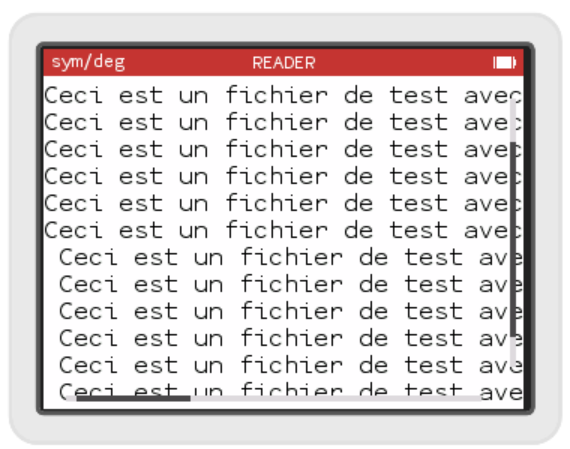

# Scrollbars

Si votre fichier de test est un peu gros... large et/ou long, vous avez dû vous rendre compte que pour l'instant ca ne scroll pas... Bien que ça ne soit pas la direction que je souhaite prendre, je coderais un word wrapping et un défilement page par page après, mais certains d'entre vous préférerons peut-être les scrollbars et c'est une logique utile à d'autres applications. Alors voyons comment rajouter des scrollbars.

## Le header

Cela se passe dans le `ReadBookController`. Nous allons rajouter un membre `ScrollableView` qui est une classe gérant le scrolling d'une vue fille, notre `PointerTextView` sera cette vue fille. La `ScrollableView` gère les événements clavier, pour cela il faut qu'elle soit "first responder". Elle a besoin d'un `ScrollViewDataSource` qui va stocker où on en est dans le scrolling, nous allons faire hériter notre `ReadBookController` de `ScrollViewDataSource`.

Notre classe ressemble donc à ça :
```c++
class ReadBookController : public ViewController, ScrollViewDataSource {
public:
  ReadBookController(Responder * parentResponder);
  View * view() override;

  void setBook(const External::Archive::File& file);

  void didBecomeFirstResponder() override;
  
private:
  PointerTextView m_readerView;
  ScrollableView m_scrollView;
};
```

## L'implémentation

Dans le constructeur, il nous faut initialiser la `ScrollableView` en passant le parent (`this`), la vue fille `m_readerView` et le `ScrollViewDataSource` à nouveau `this`. Nous demandons également à la `ScrollableView` d'afficher des scrollbars :
```c++
ReadBookController::ReadBookController(Responder * parentResponder) :
  ViewController(parentResponder),
  m_scrollView(this, &m_readerView, this)
{
  m_scrollView.setDecoratorType(ScrollView::Decorator::Type::Bars);  
}
```

La méthode `view()` change, elle renvoie maintenant la `ScrollableView` :
```c++
View * ReadBookController::view() {
  return &m_scrollView;
}
```

et nous implémentons `didBecomeFirstResponder` pour que la `ScrollableView` capte les événements clavier.
```c++
void ReadBookController::didBecomeFirstResponder()
{
  Container::activeApp()->setFirstResponder(&m_scrollView);
}
```

Et voilà, normalement ça devrait être tout. Vous pouvez essayer. Malheureusement vous constaterez peut être un bug au niveau de la scrollbar horizontale. Au moment où j'écris ces lignes il y a selon moi un bug dans le code de la Numworks, peut être sera t-il corrigé au moment où vous lirez ces lignes.

## Un bug ?

Un code de la numworks calcule la place occupé par un texte en fonction de la police utilisée. Ce code se situe dans `kandisky/src/font.cpp`

La méthode `stringSizeUntil` ressemble à ça :

```c++
KDSize KDFont::stringSizeUntil(const char * text, const char * limit) const {
  if (text == nullptr || (limit != nullptr && text >= limit)) {
    return KDSizeZero;
  }
  KDSize stringSize = KDSize(0, m_glyphSize.height());

  UTF8Decoder decoder(text);
  const char * currentStringPosition = decoder.stringPosition();
  CodePoint codePoint = decoder.nextCodePoint();
  while (codePoint != UCodePointNull && (limit == nullptr || currentStringPosition < limit)) {
    KDSize cSize = KDSize(m_glyphSize.width(), 0);
    if (codePoint == UCodePointLineFeed) {
      cSize = KDSize(0, m_glyphSize.height());
    } else if (codePoint == UCodePointTabulation) {
      cSize = KDSize(k_tabCharacterWidth * m_glyphSize.width(), 0);
    } else if (codePoint.isCombining()) {
      cSize = KDSizeZero;
    }
    stringSize = KDSize(stringSize.width() + cSize.width(), stringSize.height() + cSize.height());
    currentStringPosition = decoder.stringPosition();
    codePoint = decoder.nextCodePoint();
  }
  return stringSize;
}
```

Elle semble parcourir le texte caractère par caractère de `text` à `limit`, en réalité `CodePoint` par `CodePoint`, un `CodePoint` correspondant à un caractère affiché mais pouvant occuper plus d'un caractère dans la chaîne `text` à cause de la normalisation des caractères accentués. Pour chaque `CodePoint` la fonction incrémente une `stringSize`, en gérant les sauts de ligne (`UCodePointLineFeed`) pour agrandir en largeur et en hauteur la taille du bloc de texte. Malheureusement la fonction ne tient pas compte du fait que lorsqu'on va à la ligne le compte de la largeur devrait reprendre à 0. Ce qui fait que la largeur du texte pour elle est en fait la largeur totale qu'aurait le texte s'il ne tenait que sur une seule ligne.

## Une correction ?

Peut-être que je me trompe sur ce qu'est sensé faire cette fonction, et la corriger pourrait modifier le comportement actuel d'autres applications de la Numworks, faire une correction est donc risquée. Je pense cependant que la fonction devrait s'écrire ainsi :
```c++

KDSize KDFont::stringSizeUntil(const char * text, const char * limit) const {
  if (text == nullptr || (limit != nullptr && text >= limit)) {
    return KDSizeZero;
  }
  
  int curWidth = 0;
  int maxWidth = 0;
  int curHeight = m_glyphSize.height();
  UTF8Decoder decoder(text);
  const char * currentStringPosition = decoder.stringPosition();
  CodePoint codePoint = decoder.nextCodePoint();
  while (codePoint != UCodePointNull && (limit == nullptr || currentStringPosition < limit)) 
  {
    if (codePoint == UCodePointLineFeed) 
    {
      if(curWidth>maxWidth)
      {
        maxWidth=curWidth;
      }
      curWidth = 0;
      curHeight += m_glyphSize.height();
    } 
    else if (codePoint == UCodePointTabulation) 
    {
      curWidth +=k_tabCharacterWidth * m_glyphSize.width();
    }
    else if (codePoint.isCombining()) 
    {
    }
    else
    {
      curWidth += m_glyphSize.width();
    }
    currentStringPosition = decoder.stringPosition();
    codePoint = decoder.nextCodePoint();
  }
  if(curWidth>maxWidth)
  {
    maxWidth = curWidth;
  }
  return KDSize(maxWidth, curHeight);
}
```

Dans ma solution, je manipule une largeur courante `curWidth` et une largeur maximum (la largeur de la ligne la plus longue) `maxWidth`. Quand on va à la ligne je compare `curWidth` à `maxWidth` pour éventuellement mettre `maxWidth` à jour et je remets `curWidth` à 0.

Avec cette correction, le scrolling horizontal dans notre application fonctionnera nettement mieux...


