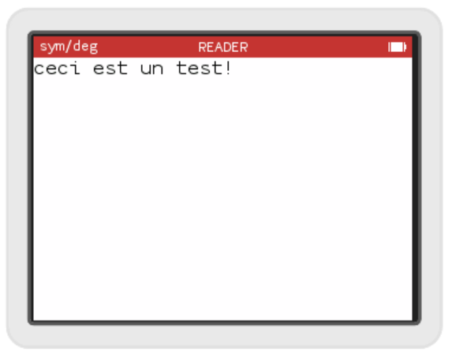

# Empilons un nouveau contrôleur

Nous pouvons maintenant choisir un fichier à ouvrir! Une fois ouvert, nous allons avoir besoin d'un nouvel écran, soit une nouvelle vue et un nouveau contrôleur. Commençons par le contrôleur, créons nos 2 fichiers : `apps\reader\read_book_controler.h` et `apps\reader\read_book_controler.cpp`. Rajoutons tout de suite ce nouveau fichier .cpp au Makefile :\
```Makefile
app_sreader_src = $(addprefix apps/reader/,\
  app.cpp \
  list_book_controller.c \
  utility.cpp \
  read_book_controller.c \
)
```
## Le ReadBookController

### Le header

Dans notre nouveau header, rajoutons les includes guards, le namespace et déclarons une nouvelle classe : `ReadBookController` dérivant de `ViewController`:
```c++
#ifndef _READ_BOOK_CONTROLLER_H_
#define _READ_BOOK_CONTROLLER_H_

#include <escher.h>

namespace reader {

class ReadBookController : public ViewController {
public:
  ReadBookController(Responder * parentResponder);
  View * view() override;  

};

}

#endif

```

Notez, l'inclusion de `<escher.h>` pour avoir accès à la classe `ViewController` dont nous dérivons, et la déclaration de la méthode `view()` qui est virtuelle pure dans `ViewController`.

Dans un premier temps nous allons utiliser une vue fournie par Numworks pour afficher le texte de notre fichier : une `PointerTextView`. Rajoutons donc un membre de cette classe dans la section `private` :
```c++
private:
    PointerTextView m_textView;
```

Rajoutons également une fonction pour que le `ListBookController` puisse indiquer au `ReadBookController` quel fichier ouvrir :
```c++
void setBook(const External::Archive::File& book);
```
pour éviter la copie de la structure `External::Archive::File` nous utilisons le passage par référence (expliqué précédemment), et comme nous n'avons pas l'intention de modifier le contenu de la structure, nous utilisons le mot clé `const`. Nous avons besoin d'inclure le header `apps/external/archive.h` .

Notre header devrait donc ressembler à ça :
```c++
#ifndef _READ_BOOK_CONTROLLER_H_
#define _READ_BOOK_CONTROLLER_H_

#include <escher.h>
#include "apps/external/archive.h"

namespace reader {

class ReadBookController : public ViewController {
public:
  ReadBookController(Responder * parentResponder);
  View * view() override;

  void setBook(const External::Archive::File& file);
  
private:
  PointerTextView m_readerView;
};

}

#endif
```
### L'implémentation

Commençons par inclure le header et ouvrir le namespace :
```c++
#include "read_book_controller.h"

namespace reader 
{

}
```

Implémentons le constructeur, qui se contente de passer le "parent responder" au `ViewController` :
```c++
ReadBookController::ReadBookController(Responder * parentResponder) :
  ViewController(parentResponder)  
{
}
```

et la méthode `view()` :
```c++
View * ReadBookController::view() 
{
  return &m_readerView;
}
```

et enfin la méthode `setBook()`, pour l'instant sur le simulateur nous n'avons pas encore chargé le contenu du fichier, on va donc pour l'instant juste mettre une chaîne de caractère "hardcodée" pour simplement vérifier que nous somme capable d'ouvrir une nouvelle vue.
```c++
void ReadBookController::setBook(const External::Archive::File& file)
{
    m_readerView.setText("ceci est un test!");//reinterpret_cast<const char*>(file.data));
}
```

## Empilons des vues


### Intégration dans l'App

Un fois la livre ouvert, on va vouloir pouvoir le fermer et revenir dans la vue précédente dans l'état où elle était. Pour cela il nous faut "empiler" les vues et les contrôleurs. Pour cela, Numworks fournie un `StackViewController`. Ce contrôleur sera à la racine de nos controlleurs, cela nécessite quelques changement dans la class `reader::App`. Tout d'abord nous lui rajoutons un membre `StackViewController m_stackViewController` :
```c++
class App : public ::App {
public:
// { autofold
  class Descriptor : public ::App::Descriptor {
  public:
    I18n::Message name() override;
    I18n::Message upperName() override;
    const Image * icon() override;
  };
  class Snapshot : public ::App::Snapshot {
  public:
    App * unpack(Container * container) override;
    Descriptor * descriptor() override;
  };
// }
private:
  App(Snapshot * snapshot);

  ListBookController m_listBookController;
  StackViewController m_stackViewController;
};
```

Cela impacte également le constructeur de l'`App`, il faut en effet "brancher" tout ça correctement. Il faut que le `m_stackViewController` soit le contrôleur racine de l'`App`, il sera également le "parent responder" du `m_listBookController` et il faut mettre le `m_listBookController` comme premier élément de la pile du `m_stackViewController` :
```c++
App::App(Snapshot * snapshot) :
  ::App(snapshot, &m_stackViewController),
  m_listBookController(&m_stackViewController),
  m_stackViewController(nullptr, &m_listBookController)
{
}
```

### Intégration dans le ListBookController

Il nous faut rajouter le code nécessaire à l'ouverture du `ReadBookController` depuis le `ListBookController`. Pour cela il nous faut redéfinir la fonction de gestion des événements : `handleEvent()`, rajouter un membre `ReadBookController`, et rajouter l'include : 

```c++
#include "read_book_controller.h"

namespace reader {

class ListBookController : public ViewController, public SimpleListViewDataSource, public SelectableTableViewDataSource
{
public:
// { autofold
    ListBookController(Responder * parentResponder);
    View * view() override;

    int numberOfRows() const override;
    KDCoordinate cellHeight() override;
    HighlightCell * reusableCell(int index) override;
    int reusableCellCount() const override;
    void willDisplayCellForIndex(HighlightCell * cell, int index) override;
    void didBecomeFirstResponder() override;
// }    
    bool handleEvent(Ion::Events::Event event) override;
    
private:
// { autofold
    SelectableTableView m_tableView;

    static const int NB_FILES = 20;
    External::Archive::File m_files[NB_FILES];
    int m_nbFiles = 0;

    static const int NB_CELLS = 6;
    MessageTableCell m_cells[NB_CELLS];
// }
    ReadBookController m_readBookController;
};

}
```

Au niveau de l'implémentation, il nous faut initialiser le `ReadBookController` dans le constructeur :
```c++
ListBookController::ListBookController(Responder * parentResponder):
    ViewController(parentResponder),
    m_tableView(this, this, this),
    m_readBookController(this)
{
    m_nbFiles = filesWithExtension(".txt", m_files, NB_FILES);
}
```

L'ouverture du fichier choisi se fait dans le `handleEvent()`. Cette méthode recoit en paramètre l'`event` qui indique quelle touche a été pressée. On va ouvrir le fichier en cas de click sur "ok", "exe" et "right". Pour ouvrir le fichier, nous devons passer le fichier sélectionné au `ReadBookController`, la méthode `selectedRow()` nous indique quelle est l'indice de la ligne (et donc du fichier) selectionné. Il nous faut empiler le `ReadBookController` dans le `StackViewController` et pour finir indiquer qu'il est maintenant le "first responder" (le controller recevant les événements) :
```c++
bool ListBookController::handleEvent(Ion::Events::Event event)
{
    std::cout<<selectedRow()<<std::endl;
    if (event == Ion::Events::OK || event == Ion::Events::EXE || event == Ion::Events::Right)
    {
        
        m_readBookController.setBook(m_files[selectedRow()]);
        static_cast<StackViewController*>(parentResponder())->push(&m_readBookController);
        Container::activeApp()->setFirstResponder(&m_readBookController);
        return true;
    }

    return false;
}
```

Une ligne peut soulever quelques question :
```c++
static_cast<StackViewController*>(parentResponder())->push(&m_readBookController);
```
Notre `ListBookController` ne "tient" pas le `StackViewController`, mais on sait qu'il s'agit de son parent, on peut donc caster le retour de la méthode `parentResponder()` en `StackViewController*`.

Si je n'ai rien oublié, normalement nous devrions obtenir l'écran suivant une fois n'importe quel fichier ouvert :



A suivre...
