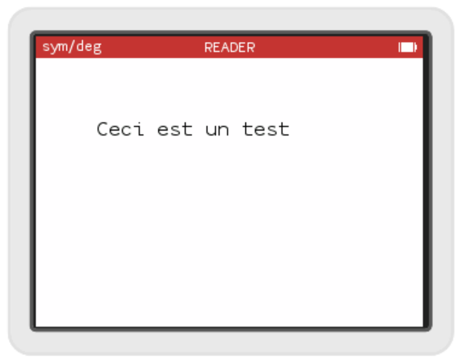

# Word wrapping TextView - partie 1

Personnellement je préfère que le texte aille à la ligne plutôt que d'avoir à scroller horizontalement. Numworks ne propose pas une telle `TextView` nous allons donc l'implémenter et remplacer la `ScrollView` et la `PointerTextView` que nous avons utilisé jusqu'à présent.

Créons donc nos 2 nouveaux fichiers: `apps\reader\word_wrap_view.h` et `apps\reader\word_wrap_view.cpp` et ajoutons ce fichier .cpp à notre Makefile :\
```Makefile
app_sreader_src = $(addprefix apps/reader/,\
  app.cpp \
  list_book_controller.cpp \
  utility.cpp \
  read_book_controller.cpp \
  word_wrap_view.cpp \
)
```

## Mise en place

### Le header

Dans notre header, rajoutons les include guards, l'include de `escher` et le namespace :
```c++
#ifndef _WORD_WRAP_VIEW_H_
#define _WORD_WRAP_VIEW_H_

#include <escher.h>

namespace reader
{
    
}

#endif
```

Et définissons notre classe qui va dériver de `PointerTextView`. Nous allons nous même coder l'affichage de cette `View`, pour cela nous redéfinissons `drawRect`.
```c++
class WordWrapTextView : public PointerTextView {
public:

  void drawRect(KDContext * ctx, KDRect rect) const override;
  
protected:
  
};

```

Nous ne définissons pas de constructeur, C++ en fournit un par défaut qui appelle le constructeur de la classe mère sans lui passer de paramètre, ce qui nous convient pour l'instant.

### L'implémentation
Dans notre fichier d'implémentation, nous incluons notre header, ouvrons le namespace et codons une méthode `drawRect` la plus simple possible, pour juste vérifier que notre vue s'affiche.
```c++
#include "word_wrap_view.h"

namespace reader
{
void WordWrapTextView::drawRect(KDContext * ctx, KDRect rect) const
{
     ctx->fillRect(KDRect(0, 0, bounds().width(), bounds().height()), m_backgroundColor);
     ctx->drawString("Ceci est un test", KDPoint(50,50), m_font, m_textColor, m_backgroundColor);
}

}
```

Pour dessiner ou écrire à l'écran, on utilise une classe que `drawRect` reçoit en paramètre : un `KDContext` qui fournit des fonctions pour écrire, dessiner des lignes ou des formes géométriques. 

Nous commençons par remplir l'écran d'un grand rectangle de la couleur du fond (`m_backgroundColor` qui est un attribut de la `TextView` dont nous dérivons). Nous obtenons les dimensions de l'écran avec la fonction `bounds()` qui nous renvoie un `KDSize` dont nous extrayons la largeur avec `width()` et la hauteur avec `height()`.

Nous écrivons ensuite une chaîne de caractère, aux coordonnée (50, 50), dans la police `m_font` et la couleur `m_textColor` sur un fond `m_backgroundColor` qui sont encore des membres de la classe dont nous dérivons.

### L'intégration

Il nous reste à intégrer notre nouvelle vue dans l'application, pour cela, enlevons la `ScrollableView` de notre `ReadBookController` et remplaçons la `PointerTextView` par notre `WordWrapTextView`. On peut enlever le `didBecomeFirstResponder`

Notre fichier `apps\reader\read_book_controller.h` devient :
```c++
#ifndef _READ_BOOK_CONTROLLER_H_
#define _READ_BOOK_CONTROLLER_H_

#include <escher.h>
#include "apps/external/archive.h"

#include "word_wrap_view.h"

namespace reader {

class ReadBookController : public ViewController {
public:
  ReadBookController(Responder * parentResponder);
  View * view() override;

  void setBook(const External::Archive::File& file);

  
private:
  WordWrapTextView m_readerView;  
};

}

#endif
```

Au niveau de l'implémentation du `ReadBookController`, on adapte le constructeur :
```c++
ReadBookController::ReadBookController(Responder * parentResponder) :
  ViewController(parentResponder)  
{  
}
```

et la méthode `view` :
```c++
View * ReadBookController::view() {
  return &m_readerView;
}
```

et si nous n'avons rien oublié, ça donne ça :


