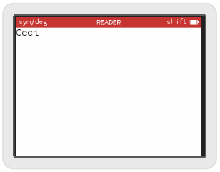
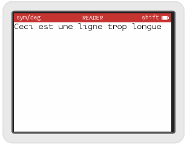
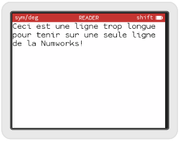

# Word wrapping TextView - partie 2

Nous avons l'architecture pour notre `WordWrapView`, il est temps de nous intéresser à l'algorithme qui va réaliser l'affichage. Le principe est le suivant: nous allons lire le texte mot par mot en coupant sur les sauts de ligne et les espaces. Avant d'écrire le mot à l'écran, nous allons nous assurer qu'il y a la place de le mettre en comparant ses dimensions à l'espace restant. S'il n'y a pas la place, nous retournerons à la ligne, et si cette ligne est hors de l'écran, on s'arrêtera. C'est parti ?

## Un premier mot

Progressons par étape. Dans un premier temps dessinons le premier mot de notre fichier.
Reprenons notre fonction :
```c++
void WordWrapTextView::drawRect(KDContext * ctx, KDRect rect) const
{
     ctx->fillRect(KDRect(0, 0, bounds().width(), bounds().height()), m_backgroundColor);
```

Nous venons de remplir l'écran de la couleur du fond. Cherchons maintenant le premier mot à afficher. Pour cela Numworks fournit une méthode: `UTF8Helper::EndOfWord` :
```c++
    const char * startOfWord = text();//le début du premier mot
    const char * endOfWord = UTF8Helper::EndOfWord(startOfWord);//la fin du mot
```

Nous allons garder en mémoire la position du texte à l'écran. A chaque fois que nous dessinerons le texte, nous déplacerons cette position :
```c++
    KDPoint textPosition(0, 0);
```

La fonction `drawString` dessine une chaîne de caractère terminée par le caractère `NULL` (0). Or notre mot qui commence à startOfWord et se finit à endOfWord ne se termine pas par un caractère `NULL` (sauf si notre mot est la fin de la chaîne). Nous allons donc copier notre mot dans un tableau où nous pourrons mettre notre caractère `NULL`, on ne veut en effet pas écrire dans notre chaîne de caractère qui est le fichier en mémoire lui même (d'ailleurs je ne suis pas sûr que ça soit possible d'écrire dans cette zone de la mémoire). Pour faire la copie il existe une fonction C `strncpy` qui n'est pas disponible sur la Numworks. Nous coderons une fonction similaire après que nous appellerons `stringCopyN` supposons dans un premier temps qu'elle existe. Il nous faut tout d'abord un tableau de caractère où copier notre mot :
```c++
    const int wordMaxLength = 128;
    char buff[wordMaxLength];
    stringNCopy(word, wordMaxLength, startOfWord, endOfWord-startOfWord);
```
La soustraction des 2 pointeurs de chaîne de caractère, donne la longueur du mot.

Dessinons notre mot.
```c++
    ctx->drawString(word, textPosition, m_font, m_textColor, m_backgroundColor);
}
```

### Copie de chaînes de caractères

Avant de tester, allons dans notre fichier `apps\reader\utility.h` pour y déclarer notre fonction :
```c++
void stringNCopy(char* dest, int max, const char* src, int len)
```

Et dans la zone du fichier `apps\reader\utility.cpp` qui est compilée à la fois pour le simulateur et la calculatrice, rajoutons :
```c++
void stringNCopy(char* dest, int max, const char* src, int len)
{
    while(len>0 && max >1 && *src!=NULL)
    {
        *dest = *src;
        dest++;
        src++;
        len--;
        max--;
    }
    *dest=0;
}
```

L'algorithme est le suivant. Tant qu'il reste des caractère en entrée (`len>0`), qu'on a encore de la place dans le tableau de sortie (`max>1`) (on se réserve une case pour mettre le caractère `NULL`) et tant qu'on n'a pas un caractère `NULL` en entrée (`*src != NULL`), on copie l'entrée dans le tableau de sortie (`*dest = *src`), puis on se déplace d'une case dans la sortie (`dest++`), d'une case dans l'entrée (`src++`), et on décompte un caractère de l'entrée (`len--`) et de la sortie (`max--`). Quand on sort de la boucle on finit la destination par un caractère `NULL` (`*dest = 0`).

Il nous reste à rajouter dans `word_wrap_view.cpp` l'include :
```C++
#include "utility.h"
```

Notre fichier `word_wrap_view.cpp` devrait ressembler à ça :
```c++
#include "word_wrap_view.h"
#include "utility.h"

namespace reader
{
void WordWrapTextView::drawRect(KDContext * ctx, KDRect rect) const
{
     ctx->fillRect(KDRect(0, 0, bounds().width(), bounds().height()), m_backgroundColor);

    const char * startOfWord = text();
    const char * endOfWord = UTF8Helper::EndOfWord(startOfWord);

    KDPoint textPosition(0, 0);

    const int wordMaxLength = 128;
    char word[wordMaxLength];

    stringNCopy(word, wordMaxLength, startOfWord, endOfWord-startOfWord);
    
    ctx->drawString(word, textPosition, m_font, m_textColor, m_backgroundColor);
}
}
```

un premier test devrait produire celà (en fonction de votre fichier d'entrée!). Le mien contient :\
`Ceci est une ligne trop longue pour tenir sur une seule ligne de la Numworks!`



## Une ligne entière

Il s'agit maintenant de faire une boucle pour avancer de mot en mot jusqu'à la fin de la ligne sur l'écran.

Reprenons le début que nous avons déjà écrit :
```c++
void WordWrapTextView::drawRect(KDContext * ctx, KDRect rect) const
{
     ctx->fillRect(KDRect(0, 0, bounds().width(), bounds().height()), m_backgroundColor);

    const char * startOfWord = text();
    const char * endOfWord = UTF8Helper::EndOfWord(startOfWord);
    KDPoint textPosition(0, 0);

    const int wordMaxLength = 128;
    char word[wordMaxLength];
```

Rajoutons une variable dont nous allons avoir besoin, qui contient la largeur à l'écran d'un espace.
```c++
    const int spaceWidth = m_font->stringSize(" ").width();
```

Enchaînons avec une boucle, tant que le début du prochain mot n'est pas le caractère `NULL`.
```c++
    while(*startOfWord != 0)
    {

    }
```

Dans cette boucle, calculons la taille du mot courant grâce à la fonction `stringSizeUntil` de la classe `Font` (nous avions vu que cette fonction était probablement buguée, mais dans cette utilisation, elle fonctionnera). Avec la taille du texte, nous pouvons calculer la position du prochain mot (en réalité, pour l'instant la position de la fin de notre mot courant).
```c++
        KDSize textSize = m_font->stringSizeUntil(startOfWord, endOfWord);
        KDPoint nextTextPosition = KDPoint(textPosition.x()+textSize.width(), textPosition.y());     
```

Nous allons maintenant regarder si la position de la fin de notre mot (donnée par `nextTextPosition`) est encore dans l'écran. Si notre mot ne rentre pas, on va pour l'instant s'arrêter là.
```c++
        if(nextTextPosition.x() > m_frame.width())
        {
            break;
        }
```

Si le mot rentre, on le dessine :
```c++
        stringNCopy(word, wordMaxLength, startOfWord, endOfWord-startOfWord);
        ctx->drawString(word, textPosition, m_font, m_textColor, m_backgroundColor);
```

Il faut maintenant calculer la position du prochain mot en rajoutant les espaces. Normalement il ne devrait y en avoir qu'un, mais bon des fois il y en a plus...
```c++
        while(*endOfWord == ' ')
        {
            nextTextPosition = KDPoint(nextTextPosition.x() + spaceWidth, nextTextPosition.y());
            ++endOfWord;
        }
```

On regarde de nouveau, une fois les espaces comptés, si notre prochain mot est encore à l'écran, sinon pour l'instant on sort.
```c++
        if(nextTextPosition.x() > m_frame.width())
        {
            break;
        }
```
Avant de revenir au début de la boucle, on met à jour la position courante, notre mot courant, et on calcule sa fin :
```c++
        textPosition = nextTextPosition;
        startOfWord = endOfWord;
        endOfWord = UTF8Helper::EndOfWord(startOfWord);
```

Notre fonction, ressemble pour l'instant à ça :
```c++
void WordWrapTextView::drawRect(KDContext * ctx, KDRect rect) const
{
     ctx->fillRect(KDRect(0, 0, bounds().width(), bounds().height()), m_backgroundColor);

    const char * startOfWord = text();
    const char * endOfWord = UTF8Helper::EndOfWord(startOfWord);
    KDPoint textPosition(0, 0);

    const int wordMaxLength = 128;
    char word[wordMaxLength];

    const int spaceWidth = m_font->stringSize(" ").width();

    while(*startOfWord != 0)
    {

        KDSize textSize = m_font->stringSizeUntil(startOfWord, endOfWord);
        KDPoint nextTextPosition = KDPoint(textPosition.x()+textSize.width(), textPosition.y());
        
        if(nextTextPosition.x() > m_frame.width())
        {
            break;
        }
        
        stringNCopy(word, wordMaxLength, startOfWord, endOfWord-startOfWord);
        ctx->drawString(word, textPosition, m_font, m_textColor, m_backgroundColor);

        while(*endOfWord == ' ')
        {
            nextTextPosition = KDPoint(nextTextPosition.x() + spaceWidth, nextTextPosition.y());
            ++endOfWord;
        }
        if(nextTextPosition.x() > m_frame.width())
        {
            break;
        }

        textPosition = nextTextPosition;
        startOfWord = endOfWord;
        endOfWord = UTF8Helper::EndOfWord(startOfWord);

    }
}
```

On peut faire un essai !



## Et finalement remplissons l'écran !

Il nous faut maintenant aller à la ligne quand notre mot ne rentre pas, ou quand les espaces nous amènent au delà de l'écran. On sortira de la boucle si on sort de l'écran.

Reprenons notre fonction au niveau de la boucle, le début ne change pas :
```c++
void WordWrapTextView::drawRect(KDContext * ctx, KDRect rect) const
{
     ctx->fillRect(KDRect(0, 0, bounds().width(), bounds().height()), m_backgroundColor);

    const char * startOfWord = text();
    const char * endOfWord = UTF8Helper::EndOfWord(startOfWord);
    KDPoint textPosition(0, 0);

    const int wordMaxLength = 128;
    char word[wordMaxLength];

    const int spaceWidth = m_font->stringSize(" ").width();

    while(*startOfWord != 0)
    {
        KDSize textSize = m_font->stringSizeUntil(startOfWord, endOfWord);
        KDPoint nextTextPosition = KDPoint(textPosition.x()+textSize.width(), textPosition.y());
        
```

Nous effectuons ensuite le même test pour savoir si notre mot ne rentre pas dans l'écran. S'il ne rentre pas, on remet la position courante au début de la ligne, et on recalcule la position du prochain mot :
```c++
        if(nextTextPosition.x() > m_frame.width())
        {
            textPosition = KDPoint(0, textPosition.y() + textSize.height());
            nextTextPosition = KDPoint(textSize.width(), textPosition.y());
        }
```

Si nous avons été à la ligne, il faut nous assurer que nous ne sortons pas de l'écran :
```c++
        if(textPosition.y() + textSize.height() > m_frame.height() - margin)
        {
            break;
        }
```

Ensuite, comme tout à l'heure nous dessinons notre chaîne de caractères et avançons notre position des espaces :
```c++
        stringNCopy(word, wordMaxLength, startOfWord, endOfWord-startOfWord);
        ctx->drawString(word, textPosition, m_font, m_textColor, m_backgroundColor);

        while(*endOfWord == ' ')
        {
            nextTextPosition = KDPoint(nextTextPosition.x() + spaceWidth, nextTextPosition.y());
            ++endOfWord;
        }
```

On regarde maintenant si les espaces nous ont entraîné hors de l'écran, si c'est le cas on place notre prochain mot au début de la ligne (notez qu'on ne met pas les espaces qui ne rentrent pas au début, c'est un choix).
```c++
        if(nextTextPosition.x() > m_frame.width())
        {
            nextTextPosition = KDPoint(0, nextTextPosition.y() + textSize.height());
        }
```

On va également gérer les sauts de lignes (le caractère `\n`). Comme pour les espaces, on va décaler le début de notre prochain mot d'une ligne tant qu'on trouve des caractères `\n` :
```c++
        while(*endOfWord == '\n')
        {
          nextTextPosition = KDPoint(0, nextTextPosition.y() + textSize.height());
          ++endOfWord;
        }  
```

Pour finir, on regarde si tout ça nous amène hors de l'écran. Si c'est le case, on sort de notre boucle.
```c++
        if(nextTextPosition.y() + textSize.height() > m_frame.height())
        {
            break;
        }
```

La fin de la boucle est la même que précédemment :
```c++
        textPosition = nextTextPosition;
        startOfWord = endOfWord;
        endOfWord = UTF8Helper::EndOfWord(startOfWord);
```

Si vous voulez toute la fonction en un bloc :
```c++
void WordWrapTextView::drawRect(KDContext * ctx, KDRect rect) const
{
     ctx->fillRect(KDRect(0, 0, bounds().width(), bounds().height()), m_backgroundColor);

    const char * startOfWord = text();
    const char * endOfWord = UTF8Helper::EndOfWord(startOfWord);
    KDPoint textPosition(0, 0);

    const int wordMaxLength = 128;
    char word[wordMaxLength];

    const int spaceWidth = m_font->stringSize(" ").width();

    while(*startOfWord != 0)
    {

        KDSize textSize = m_font->stringSizeUntil(startOfWord, endOfWord);
        KDPoint nextTextPosition = KDPoint(textPosition.x()+textSize.width(), textPosition.y());
        
        if(nextTextPosition.x() > m_frame.width())
        {
            textPosition = KDPoint(0, textPosition.y() + textSize.height());
            nextTextPosition = KDPoint(textSize.width(), textPosition.y());
        }
        if(textPosition.y() + textSize.height() > m_frame.height() - margin)
        {
            break;
        }

        stringNCopy(word, wordMaxLength, startOfWord, endOfWord-startOfWord);
        ctx->drawString(word, textPosition, m_font, m_textColor, m_backgroundColor);

        while(*endOfWord == ' ')
        {
            nextTextPosition = KDPoint(nextTextPosition.x() + spaceWidth, nextTextPosition.y());
            ++endOfWord;
        }
        if(nextTextPosition.x() > m_frame.width())
        {
            nextTextPosition = KDPoint(0, nextTextPosition.y() + textSize.height());
        }

        while(*endOfWord == '\n')
        {
          nextTextPosition = KDPoint(0, nextTextPosition.y() + textSize.height());
          ++endOfWord;
        }    

        if(nextTextPosition.y() + textSize.height() > m_frame.height())
        {
            break;
        }

        textPosition = nextTextPosition;
        startOfWord = endOfWord;
        endOfWord = UTF8Helper::EndOfWord(startOfWord);

    }
}
```

Sur mon fichier test, on obtient ça :

