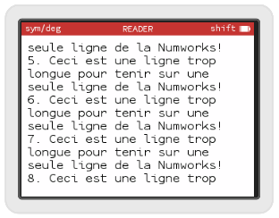

# Word wrapping TextView - partie 3

Si votre fichier de test est un peu long, vous avez dû vous rendre compte qu'il ne rentrait pas dans l'écran et que les pages ne défilaient pas toute seule... On va faire défiler les pages écran par écran plutôt que ligne par ligne.

## Page suivante

Cela n'est pas trop compliqué, rajoutons une variable, pour nous souvenir à quel endroit nous en sommes dans le fichier(`m_pageOffset`), une pour savoir où commencera la page suivante (`m_nextPageOffset`) et une fonction pour passer à la page suivante :
```c++
class WordWrapTextView : public PointerTextView {
public:

  void drawRect(KDContext * ctx, KDRect rect) const override;

  void nextPage();
  
protected:

    int m_pageOffset = 0;
    mutable int m_nextPageOffset = 0;
  
};
```

### Mutable?

Le mot clé `mutable` devant `m_nextPageOffset`a peut-être attiré votre attention. Nous allons devoir modifier cette valeur dans la méthode `drawRect`, en effet c'est à la fin du rendu de l'écran que nous savons où nous nous sommes arrêté. Le problème est que notre méthode `drawRect` est déclarée `const`, cela signifie qu'au sein de cette méthode il est interdit de modifier les attributs de la classe. Comme nous redéfinissons cette méthode de la classe dont nous héritons, nous ne pouvons pas enlever le `const`. Le mot clé `mutable` sert à indiquer qu'un attribut de la classe sera modifiable même par une méthode `const`.

### drawRect 

Au niveau de l'implémentation, commençons par adapter notre fonction `drawRect` qui au lieu n'initialiser `startOfWord` avec `text()` (qui renvoie un pointeur vers le début du fichier), l'initialisera avec l'offset de la page :
```C++
    const char * startOfWord = text() + m_pageOffset;
```
Puis à la toute fin de la fonction, hors de la boucle `while`, on calcule l'offset de la prochaine page à partir du début du prochaine mot (qui normalement est le premier mot qui ne rentre pas dans l'écran) :
```c++
m_nextPageOffset = startOfWord - text();
```

Il nous faut également implémenter la fonction `nextPage` qui se contente de mettre à jour l'offset de la page avec l'offset de la prochaine page. Puis elle indique qu'il faut redessiner l'écran.
```c++
void WordWrapTextView::nextPage()
{
  m_pageOffset = m_nextPageOffset;
  markRectAsDirty(bounds());
}
```


## Gestion des événements.

Nous allons rajouter le code de gestion des événements dans le `ReadBookController`. Pour cela rajoutons la méthode 
```c++
bool handleEvent(Ion::Events::Event event) override;
```
à la définition de la classe.

Puis dans le fichier d'implémentation, gérons l'appuie sur la touche "bas" :
```C++
bool ReadBookController::handleEvent(Ion::Events::Event event) 
{  
    if(event == Ion::Events::Down)
    {
        m_readerView.nextPage();
        return true;
    }
    return false;
}
```
Souvenez vous que votre fonction doit renvoyer `true` quand elle gère un événement, et `false` suivant pour qu'il soit envoyé au contrôleur parent.

## Retour sur la fin du fichier

Pour l'instant notre boucle de dessin de l'écran s'arrête quand elle rencontre un caractère `NULL` au début du mot en cours. Si vous avez effectué quelques tests jusqu'à la fin du fichier, vous avez peut-être constaté que des fois l'application rajoutait quelques caractères étranges à la fin du fichier.

Plutôt que de se baser sur ce caractère qui n'est visiblement pas toujours présent, nous allons nous baser sur la longueur du fichier. Pour cela il nous faut faire arriver la longueur du fichier jusqu'à la `WordWrapTextView`. Surchargeons la fonction `setText`pour qu'elle prenne en paramètre la longueur du fichier. La surcharge d'une fonction, signifie la nouvelle définition d'une fonction avec le même nom mais des paramètres différents. Rajoutons donc cette fonction à la définition de la `WordWrapTextView` :
```c++
    void setText(const char*, int length);
```
et rajoutons également une variable `m_length` pour la stocker :
```C++
class WordWrapTextView : public PointerTextView {
public:
    void drawRect(KDContext * ctx, KDRect rect) const override;
    void setText(const char*, int length);
    void nextPage();
  
protected:
    int m_pageOffset = 0;
    mutable int m_nextPageOffset = 0;

    int m_length = 0;
};
```

Au niveau de l'implémentation dans le fichier .cpp, nous rajoutons la fonction :
```c++
void WordWrapTextView::setText(const char* text, int length)
{
    PointerTextView::setText(text);
    m_length = length;
}
```
La fonction rappelle `setText` sur la classe dont `WordWrapTextView` hérite.

Enfin dans la fonction `drawRect` nous remplaçons la condition de la boucle `while` par :
```c++
...
    const char * endOfFile = text() + m_length;
    while(startOfWord < endOfFile)
...    
```

## N'allons pas trop loin

Normalement, nous devrions maintenant éviter d'afficher n'importe quoi à la fin du fichier. Par contre, si on fait défiler les pages jusqu'au bout, on finit toujours sur un écran blanc. Pour éviter ça, modifions la fonction `nextPage` :
```C++
void WordWrapTextView::nextPage()
{
    if(m_nextPageOffset >= m_length)
        return;
    m_pageOffset = m_nextPageOffset;
    markRectAsDirty(bounds());
}
```
Si l'offset du début de la prochaine page est égale à la longueur du fichier, c'est qu'il n'y a pas de page suivante... on ne fait donc rien !

## Des marges

Personnellement, je trouve peu agréable que le texte commence vraiment au ras de l'écran verticalement, comme horizontalement. Rajoutons une marge. Pour cela définissons une constante dans la class `WordWrapTextView` :
```c++
    static const int margin = 10;
```

Et adaptons notre méthode `drawRect` pour rajouter cette marge au position de début de ligne et au test de fin de ligne et fin d'écran : 
```c++
void WordWrapTextView::drawRect(KDContext * ctx, KDRect rect) const
{
     ctx->fillRect(KDRect(0, 0, bounds().width(), bounds().height()), m_backgroundColor);

    const char * endOfFile = text() + m_length;
    const char * startOfWord = text() + m_pageOffset;
    const char * endOfWord = UTF8Helper::EndOfWord(startOfWord);
    KDPoint textPosition(margin, margin);

    const int wordMaxLength = 128;
    char word[wordMaxLength];

    const int spaceWidth = m_font->stringSize(" ").width();

    while(startOfWord < endOfFile)
    {

        KDSize textSize = m_font->stringSizeUntil(startOfWord, endOfWord);
        KDPoint nextTextPosition = KDPoint(textPosition.x()+textSize.width(), textPosition.y());
        
        if(nextTextPosition.x() > m_frame.width() - margin)
        {
            textPosition = KDPoint(margin, textPosition.y() + textSize.height());
            nextTextPosition = KDPoint(margin + textSize.width(), textPosition.y());
        }
        if(textPosition.y() + textSize.height() > m_frame.height() - margin)
        {
            break;
        }

        stringNCopy(word, wordMaxLength, startOfWord, endOfWord-startOfWord);
        ctx->drawString(word, textPosition, m_font, m_textColor, m_backgroundColor);

        while(*endOfWord == ' ')
        {
            nextTextPosition = KDPoint(nextTextPosition.x() + spaceWidth, nextTextPosition.y());
            ++endOfWord;
        }
        if(nextTextPosition.x() > m_frame.width() - margin)
        {
            nextTextPosition = KDPoint(margin, nextTextPosition.y() + textSize.height());
        }

        while(*endOfWord == '\n')
        {
          nextTextPosition = KDPoint(margin, nextTextPosition.y() + textSize.height());
          ++endOfWord;
        }    

        if(nextTextPosition.y() + textSize.height() > m_frame.height() - margin)
        {
            break;
        }

        textPosition = nextTextPosition;
        startOfWord = endOfWord;
        endOfWord = UTF8Helper::EndOfWord(startOfWord);
    }
    m_nextPageOffset = startOfWord - text();
}
``` 



A suivre...
